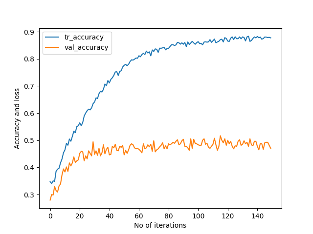

# robotic-arm-3-classes-51.7
Epoch 150: val_accuracy did not improve from 0.51667  
65/65 [==============================] - 1s 13ms/step - loss: 0.4320 - accuracy: 0.8775 - val_loss: 1.4754 - val_accuracy: 0.4704   
[[ 81  58   31]    
 [ 39  115  45]    
 [ 21  92   58]]   
81/81 [==============================] - 0s 4ms/step - loss: 0.4405 - accuracy: 0.8950   
17/17 [==============================] - 0s 3ms/step - loss: 1.2951 - accuracy: 0.5167   
Train: 0.895, Test: 0.517   
[[94  36  40]   
 [50  97  52]   
 [28  55  88]]  
 
 
